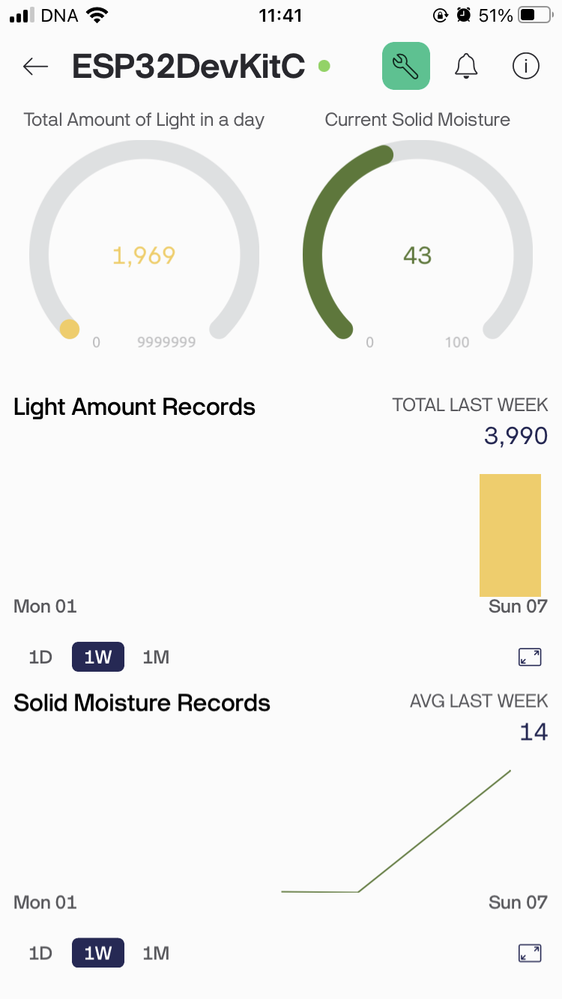
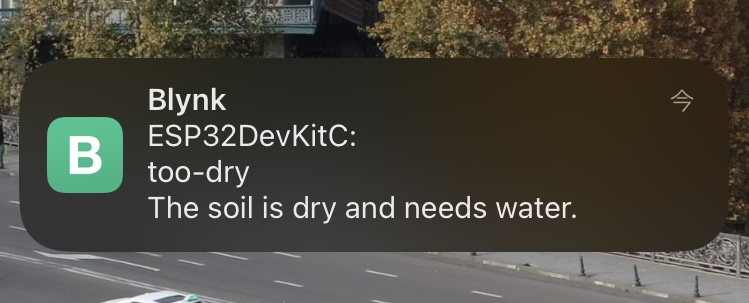

# 🌱 IoT Plant Monitoring System (ESP32 + Blynk)

This project is an **IoT-based soil moisture monitoring system** using an **ESP32 DevKitC** board, a soil moisture sensor, and the **Blynk IoT platform**.  
It measures soil moisture in real time, sends data to the Blynk mobile app, and notifies the user when watering is needed.  

---
## ⚙️ Features

- Reads soil moisture from the analog sensor.  
- Sends live data to the Blynk app.  
- Sends a push notification when soil moisture drops below 30%.  
- Reads the amount of light from the analog sensor.
- Uses FreeRTOS API's Task and Queue to manage each task.
- Prints readings to the serial monitor for debugging.  

*(Planning to extend features... )*

---
## 🎯 Purpose

I often forgot to water my plants, so I wanted a system that could notify me through an app when it was the right time to water them.  
In addition, I wanted to put into practice what I had learned about embedded development on microcontrollers by building a simple yet functional system.

---
## 🖥️ Development Environment
- **IDE:** Visual Studio Code with PlatformIO  
- **Board:** ESP32 DevKitC 

---
## 🔧 Hardware & Software Used

### Hardware
- ESP32 DevKitC
- Soil moisture sensor module
- Jumper wires & breadboard
- photoregister

### Software
- [Blynk IoT platform](https://blynk.io/)

---
## 📸 Images

### Hardware Setup

### Blynk App
#### App Screen

#### Push Notification

---
## 📈 Update Histories
  
*(As some features are implemented, this section will be updated.)*

| Date       | Update Details |
|------------|-------------------------------------------------|
| 08.2025 | Added initial features: soil moisture measurement + Blynk notification |
| 09.2025 | Added light sensor (photoresistor) measurement feature + Used FreeRTOS APIs (Task, Queue) |

